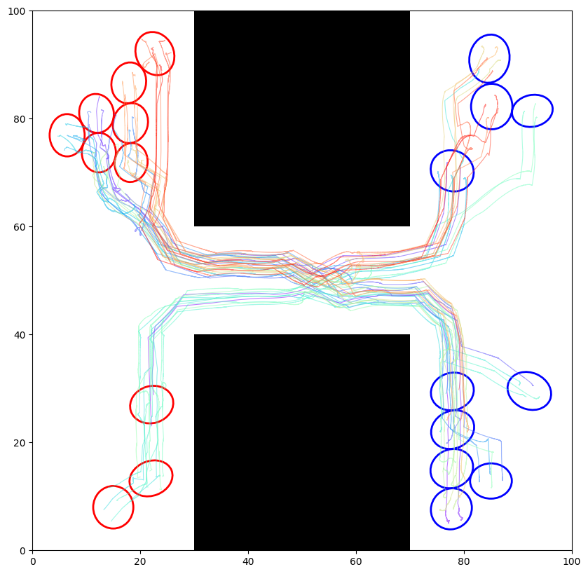
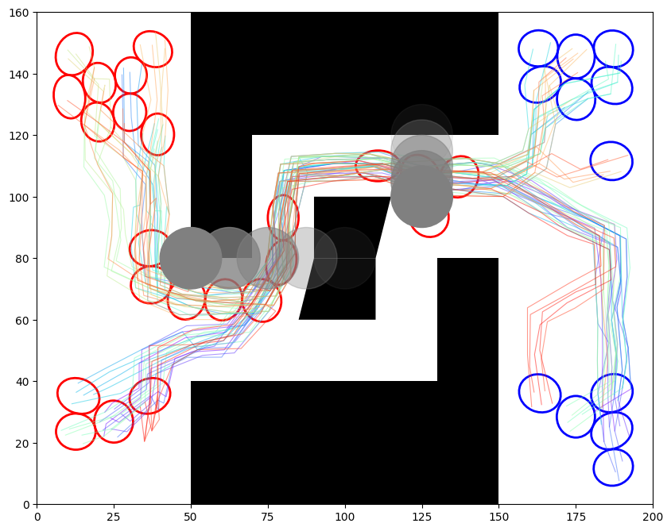
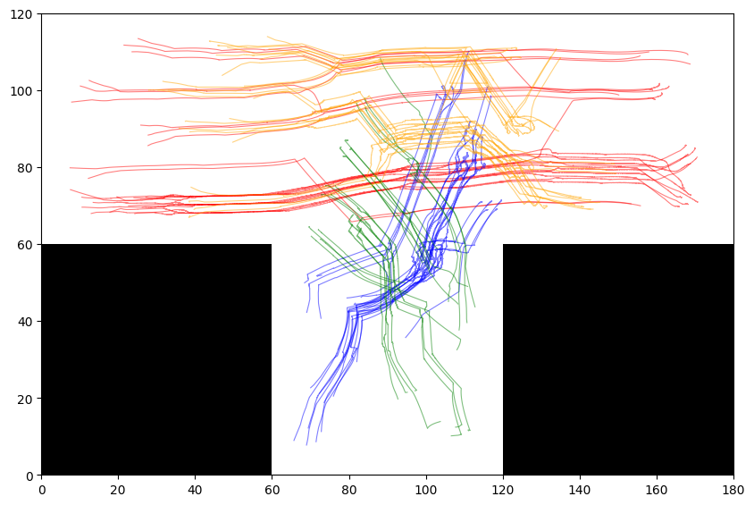

# ST-Gaussian PRM 

A python implementation for spatial temporal swarm planning on Gaussian PRMs

We first construct Gaussian PRM based on a given map, and then interatively solve a maximum flow problem on a temporal-extended graph.

This planner supports planning with predefined dynamic obstacles and multi-swarm planning.

## Static Experiment



<video width ="640" height="360" controls>
    <source src="./media/static_experiment.mp4" type="video/mp4">
</video>

## Dynamic Experiment



<video width ="640" height="360" controls>
    <source src="./media/dynamic_experiment.mp4" type="video/mp4">
</video>

## Multi-Swarm Experiment



<video width ="640" height="360" controls>
    <source src="./media/multi_swarm_experiment.mp4" type="video/mp4">
</video>

## Installation

Use conda to install the environment dependencies, and use pip to install the st_gaussian_prm package

```shell
conda env create -f environment.yml
conda activate ST_Gaussian_PRM
pip install -e . 
```

## Usage

### Map Generation

To genereate the test maps, run:
``` shell
cd scripts
python map_generation.py
```

### Qualitative Experiments

Use the jupyter notebooks in `notebooks` folder for static experiment, dynamic experiment and multi-swarm experiment with visualization. The test configs are stored in `notebooks/configs` folder, with the corresponding yaml files.


### Quantitative Experiments

To run the experiment, execute the following script. Results will be stored in a results folder.

```shell
cd scripts/experiments/static
python solver_experiment.py 
```


